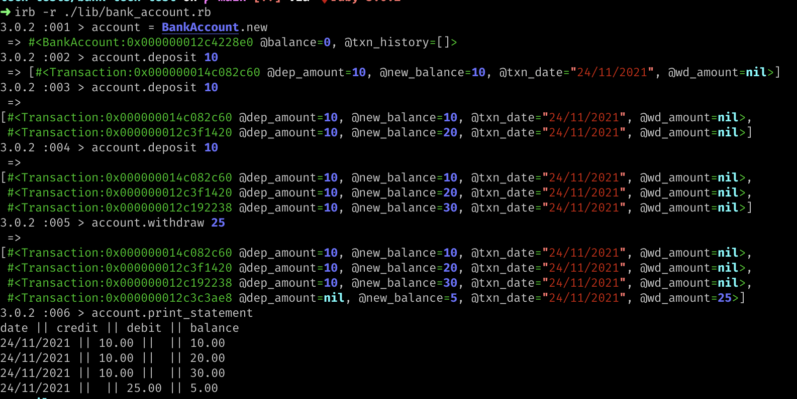
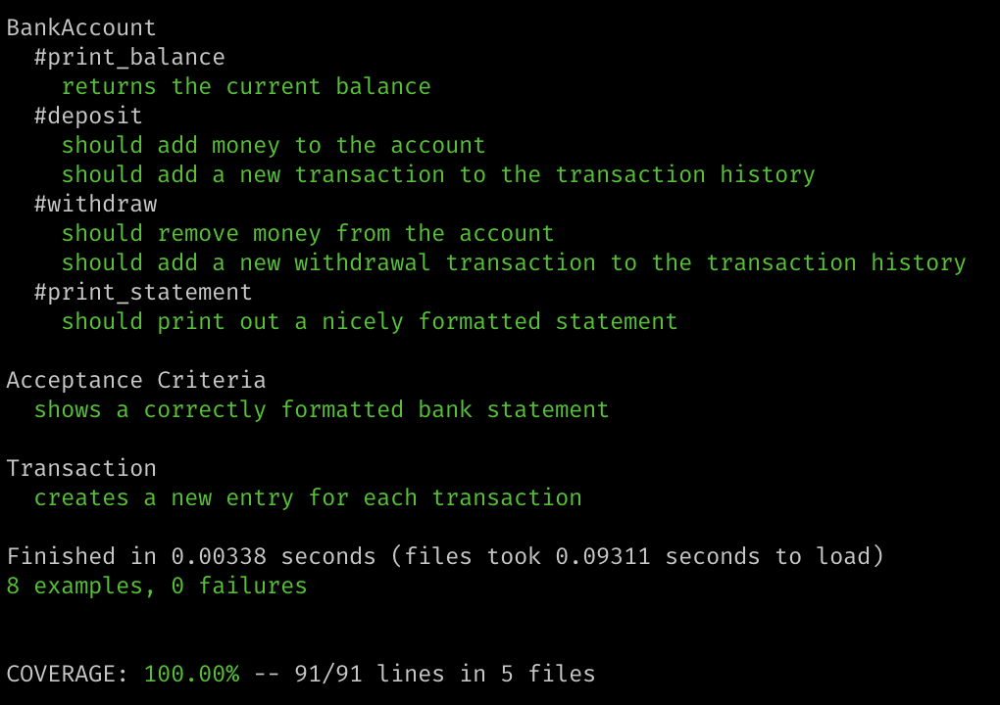
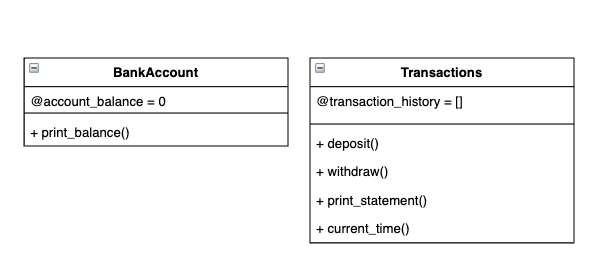

# Bank tech test

## Requirements
* You should be able to interact with your code via a REPL like IRB or the JavaScript console. (You don't need to implement a command line interface that takes input from STDIN.)
* Deposits, withdrawal.
* Account statement (date, amount, balance) printing.
* Data can be kept in memory (it doesn't need to be stored to a database or anything).

## Project Outline

Language: Ruby

### Setup & Usage

In your terminal, you can run the following commands. If you don't already have Bundler installed, please run: 
``` 
$ gem install bundler 
```
Please clone the repo and access the project folder:
```
$ git clone git@github.com:s-palmer/bank-tech-test.git
```
```
$ cd bank-tech-test
```
Next install any gems required for the project using:
```
$ bundle install
```
You will then be able to launch the application into IRB by running:
```
$ irb -r ./lib/bank_account.rb
```
In IRB, you can then interact in the following ways:
* Create a new account
```
$ account = BankAccount.new
```
* Deposit money
```
$ account.add(num)
```
* Withdraw money
```
$ account.withdraw(num)
```
* View balance
```
$ account.print_balance
```
* Print Account Statement
```
$ account.print_statement
```

## Program Screenshot


## Test Coverage



## Specification

### Creating User Stories From Requirements

```
As a bank account holder,
So that I can interact with my bank account
The program should work using IRB
```
```
As a bank account holder,
So that I can add my money to the account
I want to be able to make a deposit.
```
```
As a bank account holder,
So that I can spend my money
I want to be able to make a withdrawal.
```
```
As a bank account holder,
So that I can see how much money I have
I want to be able to review account statements
```

### Class Model From User Stories

Based on the user stories, I came up with the following initial class / method models to describe how I think my program will look.
From the requirements, I initially decided to create 2 classes, a Bank Account class and a Transaction class. 

The Bank Account class will be responsible for initialising an empty account and contains just one method for now, which is a print_balance method.

The Transaction class will have 4 methods, and a Transaction History attribute to store a record of Transactions. I have currently given the Transaction class 4 methods - however I may look to extract the print_statement method out into its own Statement class. 



After some consideration, I decided that my original plan wasn't how I wanted to complete this challenge, and didn't make sense.

As such, after creating my initial Bank Account class, I decided to implement more methods on this class instead of the Transaction class, including depositing and withdrawing.

 Now each instance of the Bank account class will be responsible for storing its own Transaction history, as well as instantiating new instances of the Transaction class every time a deposit or withdrawal is made. These Transaction instances will store the information that will be required for creating formatted statements.

I tried to further break out classes by creating a Statement class to be responsible for printing the formatted statements. However, due to issues mocking the Transactions to be inserted, I rolled back my code. I tried to use doubles of my Transaction class instances to do this - however it was unsuccesful. 

### Edge Cases to consider
* Becoming overdrawn - prevent transactions that would create a negative balance

## Acceptance criteria

* Given a client makes a deposit of 1000 on 10-01-2023
* And a deposit of 2000 on 13-01-2023
* And a withdrawal of 500 on 14-01-2023
* When she prints her bank statement
* Then she would see

```
date || credit || debit || balance
14/01/2023 || || 500.00 || 2500.00
13/01/2023 || 2000.00 || || 3000.00
10/01/2023 || 1000.00 || || 1000.00
```
